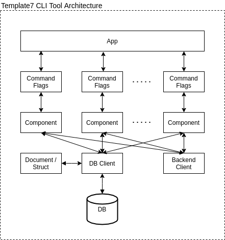

<p>
  
</p>

# Template7-CLI-Tool

[](https://github.com/tterb/atomic-design-ui/blob/master/LICENSEs)

Template for CLI tool write by go.

<br/>

## Architecture

<p >
  
</p>

For clean logic and easy-maintainable purpose, suggest each layer to access its next layer's function / method only,
do not implement cross layer function call.

For example: command layer should not access db client directly, suggest to access by correspond component instead.

| Layer | Function |
| :--- | :--- |
| APP | CLI entry. |
| Command & Flags | Define each command and its flags. |
| Component | Core business logic, include third-party client. |
| DB Client | DB manipulation functions. |
| Backend Client | Client to access [backend API](https://github.com/Template7/backend/blob/main/resource/api-documentation.pdf). |
| Document / Struct | Definition of DB documents / structs, it could be referenced by any layer. |

## Usage

### Help Message
```
$ /template7-cli --help
NAME:
   Template7 CLI Tool - A new cli application

USAGE:
   template7-cli [global options] command [command options] [arguments...]

VERSION:
   0.1.0

COMMANDS:
   InitAdmin, ia  Initialize admin data in DB
   FakeData, fd   Write some fake data to DB
   help, h        Shows a list of commands or help for one command

GLOBAL OPTIONS:
   --help, -h     show help (default: false)
   --version, -v  print the version (default: false)
```

## Build

### Binary
```
$ make build
```

## Docker Image

```
$ docker push allensyk/template7-cli-tool:latest
```
